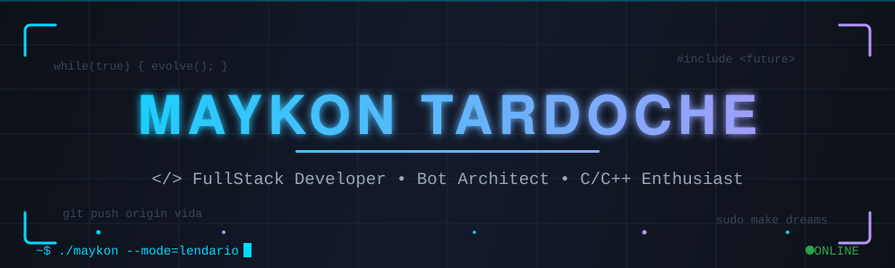
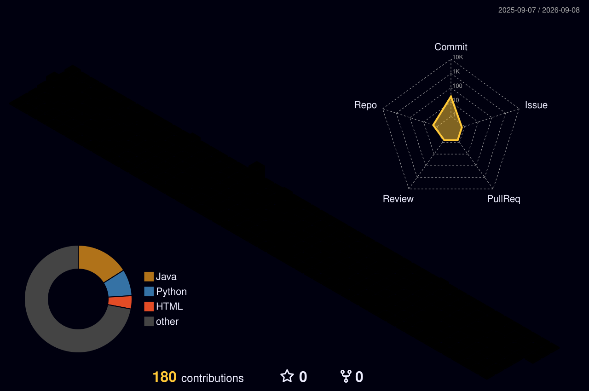

<div align="center">

<!-- ════════════════════════════════════════════════════════════════════════ -->
<!--  PERFIL GITHUB v2.0 — MAYKON TARDOCHE // EDIÇÃO OUTRO MUNDO               -->
<!--  Banner e divisores: SVGs animados EXCLUSIVOS (pasta assets/)             -->
<!--  Paleta: Ciano Neon #00D9FF · Roxo #BD93F9 · Dark #0D1117                 -->
<!--  IMPORTANTE: suba a pasta assets/ junto com este README                   -->
<!--  Procure por "TODO" para os pontos de personalização                      -->
<!-- ════════════════════════════════════════════════════════════════════════ -->

<!-- BANNER EXCLUSIVO ANIMADO -->


<!-- TYPING ANIMATION -->
<a href="https://git.io/typing-svg">
  
</a>

<samp>▸ CRIAR &nbsp;•&nbsp; AUTOMATIZAR &nbsp;•&nbsp; ESCALAR &nbsp;•&nbsp; DOMINAR ◂</samp>

<br/><br/>

<!-- CONTADORES -->

<a href="https://github.com/maykontardoche?tab=followers">
  
</a>
<a href="https://github.com/maykontardoche?tab=repositories">
  
</a>


</div>

##  Sobre Mim

<!--  -->

```cpp
#include <iostream>
#include <vector>
#include <string>

class MaykonTardoche {
private:
    const std::string nome     = "Maykon Pablo Tardoche Barbosa";
    const int         idade    = 33;
    const std::string local    = "São Paulo, Brasil 🇧🇷";
    const std::string formacao = "Análise e Desenvolvimento "
                                 "de Sistemas — FIAP";
public:
    std::vector<std::string> paixoes() {
        return { "Tecnologia", "Inovação",
                 "Bot Development", "Alta Performance", "Modded DayZ" };
    }

    std::string focoAtual() {
        return "FullStack — do baixo nível à nuvem";
    }

    bool aceitandoNovosProjetos() { return true; }
};

int main() {
    MaykonTardoche dev;

    while (true) {   // loop infinito de evolução
        dev.aprender();
        dev.codar();
        dev.evoluir();
    }

    return 0;  // linha nunca alcançada 😎
}
```

### 🎯 O Que Me Move

- 🎓 Cursando **Análise e Desenvolvimento de Sistemas** na FIAP
- 🤖 Dono de uma **Bot Store** — automação no Discord é o meu playground
- ⚡ Apaixonado por **performance**: do JavaScript ao metal com **C/C++**
- 🌐 **FullStack de verdade**: front, back, banco de dados e deploy
- 💡 Lema: *"Coding the future, one commit at a time"* ✨

<br/>

<div align="left">

```
                                        maykon@tardoche
  ███╗   ███╗ ████████╗                 ────────────────────────────────────
  ████╗ ████║ ╚══██╔══╝                 OS.........: Windows 11 + Linux
  ██╔████╔██║    ██║                    Host.......: São Paulo, Brasil
  ██║╚██╔╝██║    ██║                    Kernel.....: Café Expresso v32 LTS
  ██║ ╚═╝ ██║    ██║                    Uptime.....: 32 anos, zero reboots
  ╚═╝     ╚═╝    ╚═╝                    Shell......: bash + discord.js
                                        IDE........: VS Code
  ~$ sudo apt install sucesso           Curso......: ADS — FIAP
  [████████████████████] 100% ✔         Stack......: FullStack + C/C++
                                        Missão.....: Automatizar o mundo
```


</div>

##  Arsenal Tecnológico

<div align="center">

### ⚔️ Linguagens de Guerra


### 🎨 Frontend & Design


### ⚙️ Backend & Bancos de Dados


### 🚀 DevOps & Ferramentas


### 🤖 Especialidades


</div>

##  Números Que Falam Por Mim

<div align="center">

<!-- SEQUÊNCIA DE COMMITS -->


<br/><br/>

<!-- RESUMO COMPLETO DO PERFIL -->


<br/>


## 🐍 A Cobra Que Devora Meus Commits

<picture>
  <source media="(prefers-color-scheme: dark)" srcset="https://raw.githubusercontent.com/maykontardoche/maykontardoche/output/github-contribution-grid-snake-dark.svg">
  <source media="(prefers-color-scheme: light)" srcset="https://raw.githubusercontent.com/maykontardoche/maykontardoche/output/github-contribution-grid-snake.svg">
  
</picture>

<!--
🎲 UPGRADE OPCIONAL — CALENDÁRIO 3D DE CONTRIBUIÇÕES (nível final boss):
1) Suba o arquivo .github/workflows/3d-contrib.yml junto com este README
2) No GitHub, vá em Actions → "Generate 3D Contribution Calendar" → Run workflow
3) Quando terminar, apague as marcações de comentário em volta da linha abaixo:


-->


## 🏆 Projetos em Destaque

<table>
<tr>
<td width="50%" align="center">
<br/>
<a href="https://github.com/maykontardoche/system-bank"><b>🏦 system-bank</b></a>
<br/><br/>
Sistema bancário construído do zero em Java — contas, transações e regras de negócio na raça.
<br/><br/>


<br/><br/>
<a href="https://github.com/maykontardoche/system-bank"></a>
<br/><br/>
</td>
<td width="50%" align="center">
<br/>
<a href="https://github.com/maykontardoche/beckend-fintech-java"><b>💳 beckend-fintech-java</b></a>
<br/><br/>
O motor financeiro de uma fintech — backend Java com a robustez que dinheiro exige.
<br/><br/>


<br/><br/>
<a href="https://github.com/maykontardoche/beckend-fintech-java"></a>
<br/><br/>
</td>
</tr>
<tr>
<td width="50%" align="center">
<br/>
<a href="https://github.com/maykontardoche/loja-store-java"><b>🛒 loja-store-java</b></a>
<br/><br/>
E-commerce com backend em Java puro — a fundação sólida da loja completa.
<br/><br/>


<br/><br/>
<a href="https://github.com/maykontardoche/loja-store-java"></a>
<br/><br/>
</td>
<td width="50%" align="center">
<br/>
<a href="https://github.com/maykontardoche/loja-store-react"><b>⚛️ loja-store-react</b></a>
<br/><br/>
A mesma loja, agora com React na veia — o par FullStack completo em ação.
<br/><br/>


<br/><br/>
<a href="https://github.com/maykontardoche/loja-store-react"></a>
<br/><br/>
</td>
</tr>
<tr>
<td width="50%" align="center">
<br/>
<a href="https://github.com/maykontardoche/ticket_trnascript"><b>🎫 ticket_trnascript</b></a>
<br/><br/>
Transcrição de tickets para servidores Discord — histórico completo, zero perda de informação.
<br/><br/>


<br/><br/>
<a href="https://github.com/maykontardoche/ticket_trnascript"></a>
<br/><br/>
</td>
<td width="50%" align="center">
<br/>
<a href="https://github.com/maykontardoche/monitor-inteligente"><b>🐍 monitor-inteligente</b></a>
<br/><br/>
Monitoramento inteligente em Python — os olhos que nunca dormem sobre o sistema.
<br/><br/>


<br/><br/>
<a href="https://github.com/maykontardoche/monitor-inteligente"></a>
<br/><br/>
</td>
</tr>
<tr>
<td colspan="2" align="center">
<br/>
<b>🤖 BOT STORE — MINHA LOJA DE BOTS PARA DISCORD</b>
<br/><br/>
Bots sob medida que vendem, atendem e automatizam servidores enquanto você dorme.
<br/><br/>
<a href="https://discord.gg/t7sY6YHa2B"></a>
<br/><br/>
</td>
</tr>
</table>


## 🌐 Vamos Construir Algo Épico Juntos?

<a href="https://api.whatsapp.com/send?phone=5511990054343" target="_blank">
  
</a>
<a href="mailto:maykonpablotardoche@gmail.com" target="_blank">
  
</a>
<!-- TODO: coloque o link do seu LinkedIn -->
<a href="https://www.linkedin.com/in/SEU-LINKEDIN" target="_blank">
  
</a>
<!-- TODO: coloque o seu @ do Instagram -->
<a href="https://www.instagram.com/SEU_PERFIL" target="_blank">
  
</a>
<a href="https://discord.gg/75YkzWJVYa" target="_blank">
  
</a>

<br/><br/>

<!-- ZONA DE DIVERSÃO -->


<br/>


<br/><br/>

### 💫 *"O futuro pertence àqueles que acreditam na beleza de seus sonhos"*

<samp>feito com 💙, café e loops infinitos</samp>

<!-- FOOTER -->


</div>
